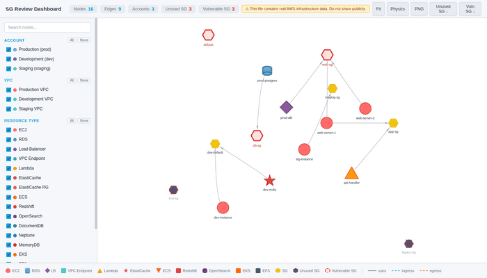

# AWS Security Group 리뷰 대시보드

[](LICENSE)
[](https://www.python.org/downloads/)

[English README](README.md)

멀티 어카운트 AWS 환경의 Security Group 관계를 시각화하는 인터랙티브 대시보드입니다. [Steampipe](https://steampipe.io)를 통해 **15개 AWS 리소스 타입**의 데이터를 수집하고, 자동 보안 분석을 수행한 후, 단일 HTML 파일로 대시보드를 생성합니다.

> **데이터는 사용자의 로컬 환경에만 저장됩니다.** 이 도구는 사용자의 워크스테이션에서만 실행됩니다. 모든 AWS API 호출은 Steampipe를 통해 사용자의 로컬 환경에서 직접 수행되며, 생성된 HTML 대시보드는 로컬 파일로만 저장됩니다. **어떠한 데이터도 외부 서버, 클라우드 서비스, 제3자에게 전송되지 않습니다.** AWS API 쿼리 외에 외부 네트워크 호출이 없으며, [소스 코드](extract_and_visualize_v2.py)를 직접 검토하여 확인할 수 있습니다 — 표준 라이브러리만 사용하는 단일 Python 스크립트입니다.



## 아키텍처

```
┌─────────────────────────────────────────────────────────────┐
│                    로컬 워크스테이션                           │
│                                                             │
│  ~/.aws/credentials ──→ extract_and_visualize_v2.py         │
│    [profile prod]         │                                 │
│    [profile dev]          ├── 1. Steampipe Aggregator 설정   │
│    [profile staging]      │                                 │
│                           ├── 2. 병렬 Steampipe 쿼리         │
│                           │      (18개 쿼리, 3 wave)         │
│                           │                                 │
│                           ├── 3. 보안 분석                   │
│                           │      • Ingress/Egress 스캔       │
│                           │      • Default SG 감사           │
│                           │      • CIDR 과다허용 탐지         │
│                           │      • Cross-SG 간접 노출        │
│                           │                                 │
│                           └── 4. HTML 대시보드 생성           │
│                                  sg_interactive_graph.html  │
│                                         │                   │
│  브라우저 ◀──── python3 -m http.server ──┘                   │
└─────────────────────────────────────────────────────────────┘
         │
         ▼  (Steampipe → AWS API 쿼리)
┌─────────────────────────────────────────────────────────────┐
│  AWS 계정들                                                  │
│  ┌──────────┐ ┌──────────┐ ┌──────────┐                    │
│  │ prod     │ │ dev      │ │ staging  │  ...                │
│  │ EC2, RDS │ │ EKS, ECS │ │ Lambda   │                    │
│  │ SG, VPC  │ │ SG, VPC  │ │ SG, VPC  │                    │
│  └──────────┘ └──────────┘ └──────────┘                    │
└─────────────────────────────────────────────────────────────┘
```

### 데이터 흐름

1. **프로필 탐색** — `~/.aws/credentials`에서 모든 AWS 프로필 자동 감지
2. **인증 확인** — `aws sts get-caller-identity`로 각 프로필 검증
3. **Steampipe Aggregator 설정** — 모든 프로필을 단일 aggregator로 통합 (기존 설정 자동 백업)
4. **병렬 데이터 수집** — 3단계 병렬 쿼리:
   - **Wave 1**: EC2, RDS, ALB/NLB, Lambda, VPC Endpoints, Security Groups, ElastiCache
   - **Wave 2**: Redshift, OpenSearch, EKS, EFS, ElastiCache 후처리, ENI
   - **Wave 3**: ECS, DocumentDB, Neptune, MemoryDB (SG 데이터 의존)
5. **보안 분석** — 수집된 규칙 기반 취약점 탐지
6. **HTML 생성** — 템플릿에 JSON 데이터 주입, 단일 HTML 파일 출력

## 사전 요구사항

### 1. Python 3.8+

```bash
python3 --version  # 3.8 이상
```

### 2. Steampipe + AWS 플러그인

```bash
# Steampipe 설치
# macOS
brew tap turbot/tap && brew install steampipe

# Linux
sudo /bin/sh -c "$(curl -fsSL https://steampipe.io/install/steampipe.sh)"

# AWS 플러그인 설치
steampipe plugin install aws

# 확인
steampipe --version
```

### 3. AWS CLI + 크리덴셜

```bash
# 프로필 설정
aws configure --profile my-profile

# 인증 확인
aws sts get-caller-identity --profile my-profile
```

스크립트가 `~/.aws/credentials`의 **모든 프로필**을 자동 감지합니다.

### 4. 필요한 IAM 권한

각 프로필의 IAM 사용자/역할에 아래 **읽기 전용** 권한이 필요합니다:

```json
{
  "Version": "2012-10-17",
  "Statement": [
    {
      "Sid": "SGDashboardReadOnly",
      "Effect": "Allow",
      "Action": [
        "ec2:DescribeSecurityGroups",
        "ec2:DescribeSecurityGroupRules",
        "ec2:DescribeInstances",
        "ec2:DescribeVpcs",
        "ec2:DescribeVpcEndpoints",
        "ec2:DescribeNetworkInterfaces",
        "rds:DescribeDBInstances",
        "elasticloadbalancing:DescribeLoadBalancers",
        "lambda:ListFunctions",
        "lambda:GetFunction",
        "ecs:ListClusters",
        "ecs:ListServices",
        "ecs:DescribeServices",
        "elasticache:DescribeCacheClusters",
        "elasticache:DescribeCacheSubnetGroups",
        "elasticache:DescribeReplicationGroups",
        "redshift:DescribeClusters",
        "es:DescribeDomains",
        "es:ListDomainNames",
        "rds:DescribeDBClusters",
        "neptune:DescribeDBClusters",
        "memorydb:DescribeClusters",
        "eks:ListClusters",
        "eks:DescribeCluster",
        "elasticfilesystem:DescribeMountTargets",
        "elasticfilesystem:DescribeFileSystems",
        "sts:GetCallerIdentity",
        "iam:ListAccountAliases"
      ],
      "Resource": "*"
    }
  ]
}
```

> **팁**: AWS 관리형 정책 `ReadOnlyAccess`로도 위 권한을 모두 커버할 수 있습니다. 최소 권한 원칙을 적용하려면 위 정책을 사용하세요.

## 설치

```bash
git clone https://github.com/zer0-kr/security-compliance-engineering-tools.git
cd security-compliance-engineering-tools/01-aws-sg-dashboard
```

추가 Python 패키지 설치 불필요 — 표준 라이브러리만 사용합니다.

테스트 실행 시:
```bash
pip install pytest
```

## 사용법

### 빠른 시작

```bash
# 모든 프로필 대상, 기본 리전(us-east-1)으로 대시보드 생성
python3 extract_and_visualize_v2.py

# 브라우저에서 열기
python3 -m http.server 8080
# http://localhost:8080/sg_interactive_graph_v2.html 접속
```

### 주요 옵션

```bash
# 특정 리전 지정
python3 extract_and_visualize_v2.py --regions ap-northeast-2 us-west-2

# Steampipe 설정 재생성 건너뛰기 (2회차부터 빠름)
python3 extract_and_visualize_v2.py --skip-config

# 출력 파일 지정
python3 extract_and_visualize_v2.py -o my-review.html

# 상세 로그
python3 extract_and_visualize_v2.py -v
```

### CLI 옵션 레퍼런스

| 플래그 | 기본값 | 설명 |
|--------|--------|------|
| `--regions` | `$AWS_DEFAULT_REGION` 또는 `us-east-1` | 쿼리할 AWS 리전 (공백 구분) |
| `--skip-config` | `false` | Steampipe aggregator 설정 생성 건너뛰기 |
| `--output`, `-o` | `sg_interactive_graph_v2.html` | 출력 HTML 파일 경로 |
| `--template` | `sg_dashboard_template.html` | HTML 템플릿 파일 경로 |
| `--verbose`, `-v` | `false` | 디버그 레벨 로깅 활성화 |

## 지원 리소스 타입 (15개)

| 리소스 | Steampipe 테이블 | 수집 항목 |
|--------|-----------------|----------|
| EC2 | `aws_ec2_instance` | 인스턴스 ID, 이름, 상태, VPC, SG, Public IP, 태그 |
| RDS | `aws_rds_db_instance` | DB 식별자, 엔진, VPC, SG, publicly_accessible, 태그 |
| ALB/NLB | `aws_ec2_application_load_balancer` 등 | LB 이름, 타입, VPC, SG |
| Lambda | `aws_lambda_function` | 함수명, VPC, SG (VPC 연결된 것만) |
| ECS | `aws_ecs_service` | 서비스명, VPC, SG (Fargate) |
| ElastiCache | `aws_elasticache_cluster` 등 | 클러스터/복제 그룹 ID, VPC, SG |
| VPC Endpoints | `aws_vpc_endpoint` | 엔드포인트 ID, 서비스명, VPC, SG |
| Redshift | `aws_redshift_cluster` | 클러스터 ID, VPC, SG |
| OpenSearch | `aws_opensearch_domain` | 도메인명, VPC, SG |
| DocumentDB | `aws_docdb_cluster` | 클러스터 ID, VPC, SG |
| Neptune | `aws_neptune_db_cluster` | 클러스터 ID, VPC, SG |
| MemoryDB | `aws_memorydb_cluster` | 클러스터명, VPC, SG |
| EKS | `aws_eks_cluster` | 클러스터명, VPC, SG |
| EFS | `aws_efs_mount_target` | 파일 시스템 ID, VPC, SG |
| ENI | `aws_ec2_network_interface` | SG 연결 정보 (미사용 SG 탐지 안전망) |

## 보안 분석

| 검사 항목 | 심각도 | 설명 |
|----------|--------|------|
| **공개 Ingress — 민감 포트** | Critical/High | `0.0.0.0/0` 또는 `::/0`에서 SSH(22), RDP(3389), MySQL(3306), PostgreSQL(5432), Redis(6379), MongoDB(27017) 등 16개 포트 탐지 |
| **공개 Egress — 민감 포트** | Critical/High | Outbound 규칙에 동일 분석 적용 |
| **Default SG에 규칙 존재 (CIS 5.4)** | Medium | AWS 기본 SG에 비기본 규칙이 있으면 플래그 |
| **Private CIDR 과다 허용** | Medium | `10.0.0.0/8`, `172.16.0.0/12`, `192.168.0.0/16`에 전 트래픽/전 포트 허용 탐지 |
| **Cross-SG 간접 노출** | Warning | SG-A가 SG-B에서 ingress 허용 + SG-B가 `0.0.0.0/0` 허용 → SG-A 간접 노출 |
| **미사용 Security Group** | Info | 어떤 리소스/ENI에도 연결되지 않은 SG |

## 대시보드 기능

### 필터링
- **Account 필터** — 계정별 리소스 보기 (색상 구분)
- **VPC 필터** — 선택한 계정 내 VPC 독립 선택
- **리소스 타입 필터** — 15개 리소스 타입별 표시/숨김
- **검색** — 이름/ID로 노드 필터링
- **미사용 SG 토글** — 미사용 SG 표시/숨김

### 상세 패널 (노드 클릭)
- Inbound/Outbound 규칙 테이블 (설명 포함)
- 취약점 경고 + 방향 표시 (↓IN / ↑OUT)
- 간접 노출 경고
- EC2 Public IP, RDS publicly_accessible 배지
- 태그 표시
- 연결된 SG / 리소스 탐색

### 내보내기
- **PNG** — 그래프 이미지 저장
- **XLSX** — 미사용/취약 SG 목록 스프레드시트 다운로드

### 키보드 단축키
| 키 | 동작 |
|----|------|
| `/` | 검색창 포커스 |
| `Escape` | 상세 패널 닫기 |
| `f` | 그래프 뷰포트에 맞추기 |

## 보안 주의사항

생성된 HTML 파일에는 **실제 AWS 인프라 데이터**(계정 ID, 리소스 ID, IP 대역, SG 규칙)가 포함됩니다.

- 생성된 파일을 **절대** 버전 관리에 커밋하지 마세요
- 생성된 파일을 **절대** 공개 채널에 공유하지 마세요
- `.gitignore`가 생성 파일을 자동 제외합니다

## 문제 해결

### "steampipe: command not found"
```bash
curl -fsSL https://steampipe.io/install/steampipe.sh | sh
steampipe plugin install aws
```

### "Could not load AWS credentials"
```bash
aws sts get-caller-identity --profile <프로필명>
# SSO 사용 시: aws sso login --profile <프로필명>
steampipe service restart
```

### 빈 그래프 / 데이터 없음
```bash
steampipe query "SELECT count(*) FROM aws_vpc_security_group"
steampipe query "SELECT count(*) FROM aws_ec2_instance"
```

### 실행 속도 개선
```bash
# 2회차부터 설정 재생성 건너뛰기
python3 extract_and_visualize_v2.py --skip-config

# 리전 제한
python3 extract_and_visualize_v2.py --regions ap-northeast-2
```

## 테스트

```bash
pip install pytest
python3 -m pytest tests/ -v
```

## 참고 자료

- [Steampipe 문서](https://steampipe.io/docs)
- [Steampipe AWS 플러그인](https://hub.steampipe.io/plugins/turbot/aws)
- [CIS AWS Foundations Benchmark](https://www.cisecurity.org/benchmark/amazon_web_services)
- [vis.js Network 문서](https://visjs.github.io/vis-network/docs/network/)

## 라이선스

MIT License — [LICENSE](LICENSE) 파일 참조.

## 기여하기

[CONTRIBUTING.md](CONTRIBUTING.md)를 참조하세요.
